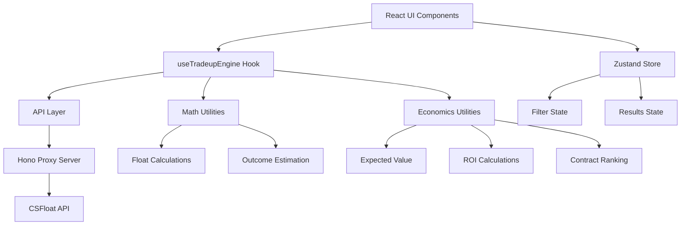

# Design Document

## Overview

The CS2 Trade-up Analyzer integrates into the existing React + TypeScript dashboard to provide automated analysis of CS2 trade-up contracts. The system leverages the current architecture with React Query for data fetching, Zustand for state management, and the existing Hono proxy server for CSFloat API communication.

The analyzer will be implemented as a new page/feature within the dashboard, following the established patterns and utilizing the existing `/lib/tradeups/` directory structure that's already been prepared.

## Architecture

### High-Level Architecture



### Integration with Existing Dashboard

The trade-up analyzer will integrate seamlessly with the current dashboard architecture:

- **Routing**: New route `/tradeups` added to the existing routing system
- **Navigation**: New navigation item in the existing toolbar/sidebar
- **Styling**: Consistent with existing glass morphism design system
- **API**: Utilizes existing proxy server at `:8787` with `/proxy/listings` endpoints
- **State Management**: Extends existing Zustand patterns for trade-up specific state

## Components and Interfaces

### Core Components

#### 1. TradeupAnalyzer (Main Page Component)
```typescript
interface TradeupAnalyzerProps {
  // Main container component for the trade-up analysis feature
}
```

**Responsibilities:**
- Orchestrates the overall trade-up analysis workflow
- Manages layout and component composition
- Handles high-level error boundaries

#### 2. WeaponSelector Component
```typescript
interface WeaponSelectorProps {
  onWeaponsSelected: (weapons: SelectedWeapon[]) => void;
  selectedWeapons: SelectedWeapon[];
  maxWeapons: number; // Always 10 for trade-ups
}

interface SelectedWeapon {
  id: string;
  name: string;
  skin: string;
  float: number;
  price_usd: number;
  market_hash_name: string;
  collection?: string;
  rarity?: string;
}
```

**Responsibilities:**
- Provides interface for selecting exactly 10 weapons
- Integrates with existing ListingCard components
- Validates weapon selection (exactly 10, valid floats, prices)
- Shows selection progress and validation feedback

#### 3. ContractOutcomes Component
```typescript
interface ContractOutcomesProps {
  outcomes: EnrichedOutcome[];
  isLoading: boolean;
  error?: string;
}

interface EnrichedOutcome {
  weapon: string;
  skin: string;
  collection: string;
  grade: string;
  probability: number;
  estimated_float: number;
  wear_tag: WearTag;
  market_price_usd: number;
  float_min: number;
  float_max: number;
}
```

**Responsibilities:**
- Displays all possible contract outcomes
- Shows probabilities, estimated floats, and market prices
- Provides visual indicators for profitability
- Allows sorting and filtering of outcomes

#### 4. ProfitabilityAnalysis Component
```typescript
interface ProfitabilityAnalysisProps {
  analysis: ContractAnalysis;
  inputCost: number;
}

interface ContractAnalysis {
  expected_value: number;
  roi_percentage: number;
  return_multiple: number;
  break_even_price: number;
  risk_assessment: RiskLevel;
  confidence_interval?: [number, number];
}
```

**Responsibilities:**
- Displays EV, ROI, and profitability metrics
- Shows risk assessment and confidence intervals
- Provides visual charts for profit distribution
- Highlights key financial metrics

### Data Layer Interfaces

#### 1. Trade-up Engine Hook
```typescript
interface UseTradeupEngineParams {
  selectedWeapons: SelectedWeapon[];
  outcomeDefinitions: OutcomeDefinition[];
  enabled?: boolean;
}

interface UseTradeupEngineResult {
  analysis: ContractAnalysis | null;
  outcomes: EnrichedOutcome[];
  isLoading: boolean;
  error: string | null;
  refetch: () => void;
}
```

#### 2. Listings API Extensions
```typescript
interface ListingsFilters {
  // Extends existing filters for trade-up specific searches
  collection?: string;
  grade?: string;
  max_price_usd?: number;
  min_float?: number;
  max_float?: number;
  suitable_for_tradeup?: boolean;
}
```

## Data Models

### Core Data Structures

#### 1. Trade-up Input Model
```typescript
interface TradeupInput {
  weapons: SelectedWeapon[]; // Exactly 10 weapons
  avg_float: number;
  total_cost_usd: number;
  collections_used: string[];
  grades_used: string[];
}
```

#### 2. Outcome Definition Model
```typescript
interface OutcomeDefinition {
  weapon: string;
  skin: string;
  collection: string;
  grade: string;
  float_min: number;
  float_max: number;
  base_probability?: number; // If not provided, calculated from input collections
}
```

#### 3. Contract Result Model
```typescript
interface ContractResult {
  input: TradeupInput;
  outcomes: EnrichedOutcome[];
  analysis: ContractAnalysis;
  created_at: Date;
  id: string;
}
```

### Mathematical Models

#### 1. Float Calculation Model
```typescript
interface FloatCalculation {
  input_floats: number[];
  avg_float: number;
  outcome_float_ranges: FloatRange[];
  estimated_outcomes: EstimatedFloat[];
}

interface FloatRange {
  min: number;
  max: number;
  weapon: string;
  skin: string;
}

interface EstimatedFloat {
  value: number;
  wear_tag: WearTag;
  weapon: string;
  skin: string;
}

type WearTag = 'FN' | 'MW' | 'FT' | 'WW' | 'BS';
```

#### 2. Economic Model
```typescript
interface EconomicAnalysis {
  input_cost: number;
  expected_value: number;
  roi: number;
  return_multiple: number;
  break_even: number;
  profit_probability: number;
  loss_probability: number;
  max_profit: number;
  max_loss: number;
}
```

## Error Handling

### Error Categories and Handling Strategy

#### 1. Validation Errors
- **Weapon Count**: Must be exactly 10 weapons
- **Float Values**: Must be between 0 and 1
- **Price Values**: Must be positive numbers
- **Market Data**: Must have valid market prices

**Handling**: Show inline validation messages, prevent submission until resolved

#### 2. API Errors
- **Rate Limiting (429)**: Automatic retry with exponential backoff
- **Server Errors (5xx)**: Retry with backoff, show user-friendly message
- **Client Errors (4xx)**: Show specific error message, no retry
- **Network Errors**: Show connectivity message, allow manual retry

**Handling**: Use existing error boundary patterns, integrate with React Query error handling

#### 3. Calculation Errors
- **Invalid Float Calculations**: Fallback to safe defaults, log error
- **Missing Market Data**: Show warning, exclude from calculations
- **Probability Calculation Errors**: Use uniform distribution fallback

**Handling**: Graceful degradation with user notifications

### Error Recovery Strategies

```typescript
interface ErrorRecoveryStrategy {
  retryable: boolean;
  fallback_action?: () => void;
  user_message: string;
  technical_details?: string;
}
```

## Testing Strategy

### Unit Testing Approach

#### 1. Pure Function Testing
- **Math utilities**: Test float calculations, clamping, rounding
- **Economic calculations**: Test EV, ROI, ranking algorithms
- **Data transformations**: Test API response parsing, model conversions

#### 2. Component Testing
- **WeaponSelector**: Test selection logic, validation, UI interactions
- **ContractOutcomes**: Test rendering, sorting, filtering
- **ProfitabilityAnalysis**: Test metric calculations, visual representations

#### 3. Integration Testing
- **useTradeupEngine**: Test hook behavior, state management, error handling
- **API integration**: Test proxy communication, error scenarios
- **End-to-end workflows**: Test complete trade-up analysis flow

### Testing Tools and Patterns

```typescript
// Example test structure
describe('TradeupEngine', () => {
  describe('Float Calculations', () => {
    it('should calculate average float correctly', () => {
      // Test avgInputFloat function
    });
    
    it('should estimate output floats within valid ranges', () => {
      // Test estimateOutputFloat function
    });
  });
  
  describe('Economic Analysis', () => {
    it('should calculate EV correctly', () => {
      // Test computeEVandROI function
    });
    
    it('should rank contracts by profitability', () => {
      // Test rankContracts function
    });
  });
});
```

### Mock Data Strategy

- **CSFloat API responses**: Mock realistic listing data
- **Market prices**: Mock price data for different wear conditions
- **Outcome definitions**: Mock contract outcome configurations
- **Error scenarios**: Mock various API error conditions

## Performance Considerations

### Optimization Strategies

#### 1. Data Fetching Optimization
- **React Query caching**: Cache market price data for common items
- **Debounced searches**: Prevent excessive API calls during weapon selection
- **Batch requests**: Group related API calls when possible
- **Prefetching**: Preload common weapon data

#### 2. Calculation Optimization
- **Memoization**: Cache expensive calculations (EV, ROI)
- **Web Workers**: Move heavy calculations off main thread if needed
- **Incremental updates**: Only recalculate when inputs change
- **Lazy loading**: Load outcome data on demand

#### 3. UI Performance
- **Virtual scrolling**: For large weapon lists
- **Component memoization**: Prevent unnecessary re-renders
- **Optimistic updates**: Show immediate feedback for user actions
- **Progressive loading**: Show partial results while calculating

### Memory Management

```typescript
// Example of optimized data structures
interface OptimizedContractData {
  // Use Maps for O(1) lookups
  weaponPrices: Map<string, number>;
  outcomeCache: Map<string, EnrichedOutcome>;
  
  // Limit cache size to prevent memory leaks
  maxCacheSize: number;
  cacheEvictionPolicy: 'LRU' | 'TTL';
}
```

## Security Considerations

### Data Security
- **API Key Protection**: All CSFloat API keys handled server-side in proxy
- **Input Validation**: Sanitize all user inputs before processing
- **Rate Limiting**: Respect CSFloat API limits, implement client-side throttling
- **Error Information**: Don't expose sensitive error details to users

### Client-Side Security
- **XSS Prevention**: Sanitize any user-generated content
- **CSRF Protection**: Use existing dashboard CSRF patterns
- **Data Validation**: Validate all data with Zod schemas
- **Secure Storage**: Don't store sensitive data in localStorage

## Deployment and Integration

### Integration Points

#### 1. Existing Dashboard Integration
- **Routing**: Add `/tradeups` route to existing router
- **Navigation**: Add trade-up analyzer to main navigation
- **Styling**: Use existing Tailwind classes and design tokens
- **State**: Integrate with existing Zustand store patterns

#### 2. Proxy Server Integration
- **Endpoints**: Use existing `/proxy/listings` endpoints
- **Authentication**: Leverage existing API key injection
- **Error Handling**: Use existing retry and backoff logic
- **Logging**: Integrate with existing request logging

### Build and Deployment
- **Development**: Use existing `pnpm dev` workflow
- **Building**: Integrate with existing Vite build process
- **Testing**: Add to existing Vitest test suite
- **Linting**: Follow existing TypeScript and ESLint rules

## Future Enhancements

### Phase 2 Features
- **Historical Analysis**: Track contract profitability over time
- **Market Trends**: Integrate price trend analysis
- **Risk Assessment**: Advanced risk modeling and confidence intervals
- **Batch Analysis**: Analyze multiple contract combinations simultaneously

### Advanced Features
- **Machine Learning**: Predict market price movements
- **Portfolio Management**: Track multiple active contracts
- **Alerts**: Notify users of profitable opportunities
- **Social Features**: Share and compare contract strategies